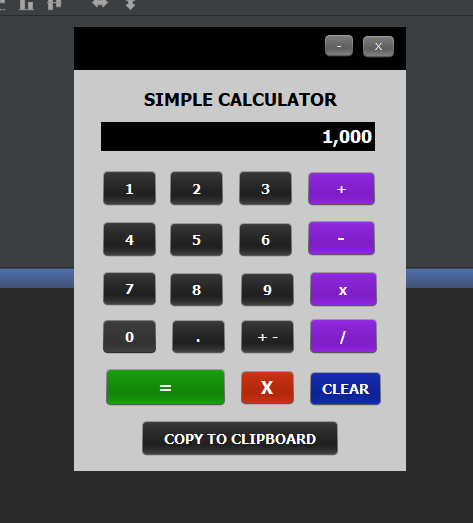

# MY SIMPLE CALCULATOR IN JAVA

* Purpose: My Project
* Programming Language: Java
* Version: Java SE 8
* IDE: NetBeans 8.2
* Type of Application: Desktop Application (Java Application)
* User Interface Design: Swing
